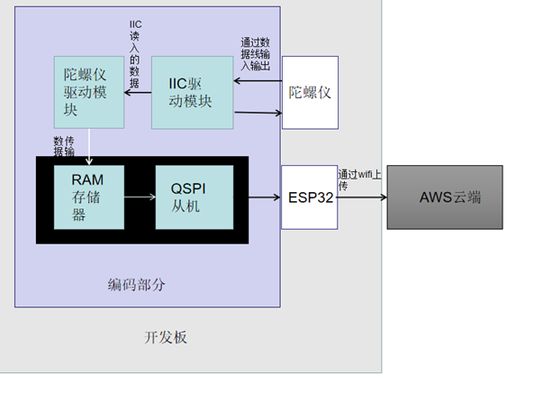
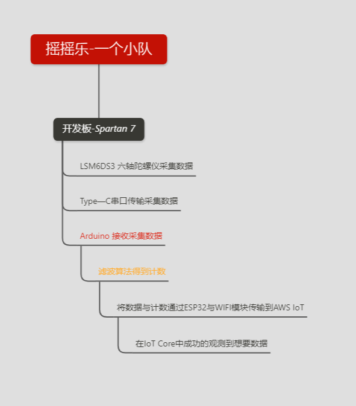

# yoyo 
 [English](https://github.com/Haotian-wang-swjtu/yoyo/blob/master/RADEME-EN.md)| 中文
 > This is a summer school internship.
 > 
 > 2020年新工科联盟-Xilinx 暑期学校（Summer School）项目 
 
 ### Inctroduction
 
 
 ##### 项目简介
 
 
 使用软件：`VIVADO 2018.3`; `Arduino IDE`;
 
 编程所用语言： `Verilog HDL`;
 
 所用SEA board: `Spartan 7`；
 
 使用云平台：`AWS IOT`；(所用账号为暑期学校提供的教育资源账号）
 
 队伍名称：`一个小队`；
 
 简介：本项目是一个基于`FPGA`的连接云项目，通过Arduino串口将板载陀螺仪读取的数据，然后上传到`AWS IOT`平台。板子首先成功的读取到板载`陀螺仪`采集的数值，然后将其通过`Type—C`串口连接到电脑，通过Arduino的串口监视器，可以成功的看到产品的数据输入;然后通过连接设定的`Wifi`，连接到对应的AWS IoT，并成功的在主题模块看到相对应的数据；后续进行过与网页端结合的想法，但由于时间问题并没有进行完成。
 
 ---
 
 ##### 项目框图
 > 大体的项目组件的结构
 

---
 
 
 ##### 项目内容
 
 
 - 板载陀螺仪采集状态数据，得到两个`Temperature data`，六个`Gyroscope data`，六个`Magnetometer data`，共14个数据。
 - 板子将采集的数据通过`Type—C`传输到电脑的Arduino串口。
 - Arduino连接`SEA board`，`Wifi`，`AWS`。
 - Arduino经过网络连接到`AWS IoT`,并将上传的数据传输到IoT云盘。
 - 利用`AWS`云端的`测试`成功的看到返回的数据。
 
 
 
 
 ---
 ---
 
 
 ### change log
 
 
 ##### v.10.15
  - 解决了数据无法正确采集的问题。
  - 更新了上传云端的结构。
 
